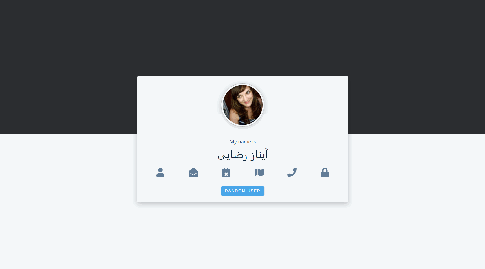

<h1 align="center">
 Random User

## 💻 Project

- Learning ReactJS.

- A simple project fetching an [external API](https://randomuser.me/) for users informations, handling _mouseOver event_ to dynamic change and display some state values.

&nbsp;&nbsp;

---

## 🔥 Check it out!

 

- [Demo](https://app-random-user.netlify.app/)

  

&nbsp;&nbsp;

---

## 🚀 Install

Clone this repository and run the following commands inside the project folder:

1. `npm install` or `yarn`;
2. `yarn start`;

To view the project you can open `http://localhost:3000`.

&nbsp;&nbsp;

---
